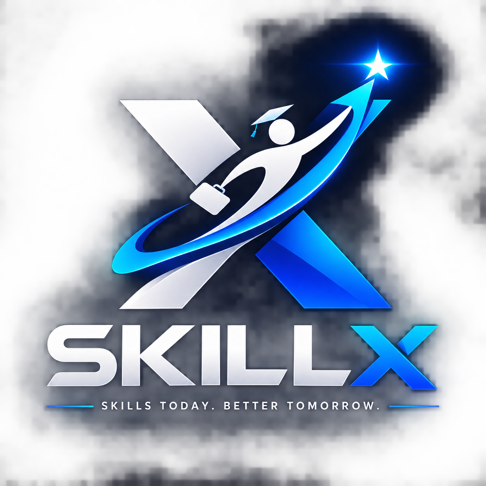
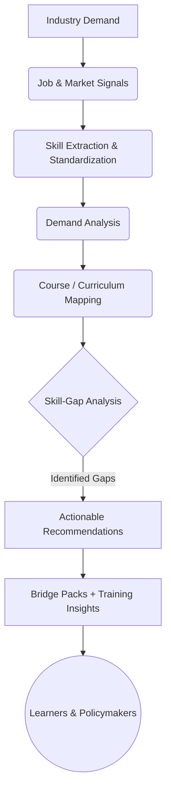
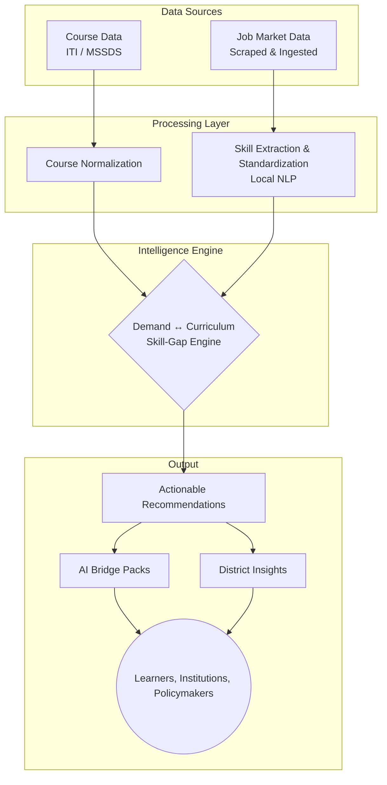

<div align="center">
  

  # SkillX 🎯
  
  ### Industry-Driven Skill & Curriculum Intelligence Platform for Maharashtra
  
  **SkillX bridges the gap between what industries demand and what training programs teach.**

  [](https://nextjs.org/)
  [](https://fastapi.tiangolo.com/)
  [](https://python.org/)


  > **SIH 2026 — Problem Statement #26134**  
  > *Challenges in aligning skill development programs with industry requirements and emerging job market demands*
</div>

---

## 🎯 Smart India Hackathon Problem Statement

### The Problem

Skill-development programs often become disconnected from rapidly changing technologies, local industry demand, emerging job roles, and employer expectations. This creates a severe **skill mismatch**:

**Industry demands new skills → Courses continue teaching outdated/insufficient skills → Learners graduate without the skills employers need.**

The SIH problem statement calls for an evidence-based system that continuously translates industry demand into **course design, capacity planning, trainer development, and candidate guidance**.

### Our Solution

**SkillX creates a continuous, automated feedback loop.**



---

## 🧩 How SkillX Solves PS #26134

| SIH Requirement | SkillX Implementation |
| :--- | :--- |
| **Analyze job-posting signals** | 🏢 **Job Market Demand Engine** |
| **Identify skills demanded by industry** | 🧠 **Skill Extraction & Standardization Engine** |
| **Analyze demand by role and skill** | 📊 **Demand Intelligence Layer** |
| **Compare industry demand with courses** | 📚 **Course Ingestion + Skill-Gap Engine** |
| **Identify curriculum skill gaps** | ⚖️ **Weighted Skill-Gap Analysis** |
| **Detect outdated / weak alignment** | 🔍 **Demand vs Curriculum Comparison** |
| **Recommend ways to close skill gaps** | ⚡ **AI Bridge Pack Generator** |
| **Support district-level planning** | 🗺️ **Maharashtra District Intelligence Map** |
| **Help learners understand career relevance** | 👨‍🎓 **Student AI Portal** |
| **Reduce dependency on expensive external AI APIs**| 🛡️ **Local NLP + Rule-Based Fallbacks** |

---

## 🚀 What SkillX Actually Does

SkillX is built around **five robust intelligence engines**:

### 1. Course Ingestion & Normalization
Ingests and standardizes course data from ITIs and MSSDS across Maharashtra's districts, creating a consistent representation of available training programs.

### 2. Job Market Demand Ingestion
Processes real-world industry and job-market signals to understand which roles, tools, and skills are currently being actively demanded by employers.

### 3. Skill Extraction & Standardization
Uses local NLP processing (SpaCy) to extract and normalize skills from messy industry requirements, drastically reducing dependency on paid, external AI APIs.

### 4. Skill-Gap Analysis
Compares the skills taught by a course with the skills demanded by the industry and calculates a precise, weighted skill-gap score.

### 5. AI Bridge Pack Generator
Converts identified skill gaps into structured **20-hour Bridge Packs**, providing a highly practical path to close the gap. Rule-based fallbacks allow the system to remain 100% functional even without an external LLM connection.

---

## 💡 Core USP

### **SkillX doesn't just tell you that a skill gap exists — it tells you exactly what is missing and what to do next.**

Traditional course catalogs primarily answer:
> *"What courses are available?"*

**SkillX answers:**
> *"Are these courses still aligned with industry demand?"*  
> *"Which specific skills are missing, and how can we close the gap today?"*

---

## 👨‍🎓 Student Portal

SkillX extends beyond policymakers and training institutions. Learners can use the specialized **Student Portal** to understand:

- Whether their enrolled course aligns with current industry demand.
- Which exact skills the course develops.
- Which *additional* skills employers are looking for.
- What personalized learning path can help bridge their identified gap.

This creates a direct connection between **macro labour-market intelligence and micro individual career decisions**.

---

## 🏗️ System Architecture



---

## 🌟 Why SkillX?

- 📍 **Maharashtra-Focused** — Designed specifically around the state's ITI/MSSDS training ecosystem and district-level requirements.
- 📈 **Evidence-Driven** — Connects training supply with actual industry demand rather than relying only on static, outdated course catalogs.
- 🔍 **Explainable AI** — Transparently identifies exactly which skills are contributing to a detected gap.
- ⚡ **Action-Oriented** — Converts theoretical gaps into highly practical Bridge Pack recommendations.
- 💰 **Cost-Efficient AI** — Local NLP and rule-based fallbacks reduce dependence on paid external APIs, ensuring long-term sustainability.
- 🤝 **Multi-Stakeholder** — Custom dashboards designed for learners, institutions, training providers, and government policymakers.

---

## 🛠️ Tech Stack

- **Frontend:** Next.js 14, React, Tailwind CSS, Lucide Icons
- **Backend:** FastAPI, SQLAlchemy, Python 3.9+
- **Database:** SQLite (Development) → PostgreSQL-ready architecture
- **AI/NLP:** spaCy-based local extraction + Google Gemini 1.5 Flash integration
- **Deployment:** Vercel (Frontend & Serverless API Proxy)

---

## ⚙️ Setup & Development

### Backend (FastAPI)

```bash
cd backend
python -m venv venv
source venv/bin/activate  # Windows: venv\Scripts\activate
pip install -r requirements.txt
uvicorn app.main:app --reload
```
*Note: The database is automatically seeded on startup for a fresh clone.*

### Frontend (Next.js)

```bash
cd frontend
npm install
npm run dev
```

---

## 🎥 Demo

**Live Application:** [SkillX on Vercel](https://skillx-ashen-two.vercel.app)

*(A working prototype demonstration showcasing the complete workflow from demand analysis to skill-gap identification and AI recommendations.)*

---

## 🔮 Future Scope

- [ ] Production migration to PostgreSQL.
- [ ] Automated, continuous expansion of the skill dictionary via web crawling.
- [ ] Broader industry/job-market data pipeline integration.
- [ ] Advanced district-level demand vs. supply spatial intelligence.
- [ ] Employer validation and feedback workflows.

---

## 📌 Project Status

**Prototype / Hackathon Implementation**

SkillX is actively being developed as a working prototype for **Smart India Hackathon 2026 — PS #26134**.
